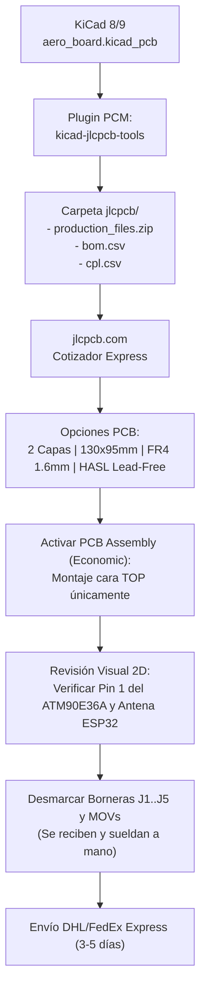

# 🚀 PLAN MAESTRO INTEGRAL DE IMPLEMENTACIÓN: MONITOR TRIFÁSICO UNIVERSAL
## ATM90E36A (TQFP-48) + ESP32-WROOM-32E (110V – 220V – 480V Sin Fusibles)
### Pipeline AERO Zero-Geometry para KiCad 8/9 — Octubre 2026

---

> [!NOTE]
> **Estado del Pipeline:** Validado exitosamente de punta a punta (Nivel 1 Shadow Interrogator, Nivel 2 SKiDL ERC con 0 errores, y Nivel 3 macro nativa KiCad 9 generando `aero_board.kicad_pcb`).

---

## 1. ESPECIFICACIÓN TÉCNICA DEL HARDWARE ACTUALIZADO & BLINDAJE PARA VENEZUELA

### 1.1 Contexto Eléctrico Nacional: Red Eléctrica de Venezuela (SEN / Corpoelec)
En la red de distribución venezolana ocurren dos fenómenos severos que destruyen instrumentación convencional:
1. **Neutro Abierto / Flotante por sulfatación o hurto de conductores:** En transformadores de poste, el neutro se desplaza hacia el potencial de fase, convirtiendo circuitos monofásicos de 120V en tensiones entre fases de 208V, 240V o picos desbalanceados sostenidos.
2. **Rechazo de Carga y Maniobras de Subestación (TOV - Sobretensión Temporal):** Tras apagones masivos o aperturas de alimentadores primarios desregulados (Guri/Central/Occidente), la tensión en las barras puede sostenerse en **600 V RMS continuos durante varios minutos** antes de normalizarse.

### 1.2 Dimensionamiento Crítico de la Cadena Atenuadora (Soporte Sostenido a 600V–750V)
* **Cadena de Cinco Resistencias SMD 1206 en Serie:**
  * Cada fase ($L_1, L_2, L_3$) se atenúa mediante **5 resistencias de $150\text{ k}\Omega\ 0.1\%$ 1206 en serie** ($R_{\text{top}} = 750\text{ k}\Omega$).
  * **Análisis Térmico a 600V RMS Sostenidos:**
    $$P_{\text{total}} = \frac{(600\text{ V})^2}{750{,}000\ \Omega} = 0.48\text{ W} \implies P_{\text{cada R}} = \frac{0.48\text{ W}}{5} = \mathbf{96\text{ mW}}$$
    En cápsulas 1206 clasificadas para 250 mW, 96 mW representa apenas el 38% de la capacidad nominal. Las resistencias se mantienen frías ($\Delta T < 4^\circ\text{C}$), garantizando estabilidad del coeficiente de temperatura ($TCR \le 25\text{ ppm/}^\circ\text{C}$).
  * **Tensión de Ruptura Dieléctrica:** 5 resistencias 1206 en serie soportan $5 \times 200\text{ V} = 1000\text{ V}$ de trabajo continuo y hasta $2500\text{ V}$ transitorios de impulso.
* **Resistencia de Cierre ($R_{\text{bottom}}$):** $470\ \Omega\ 0.1\%$ 0805.
* **Factor de Atenuación:** $\alpha = \frac{470}{750{,}000 + 470} \approx \mathbf{0.0006263}$.

### 1.3 Tabla de Niveles Eléctricos en el ADC del ATM90E36A (Rango 110V – 600V+)
El conversor ADC Sigma-Delta de 24 bits del ATM90E36A admite hasta $\pm 720\text{ mV}_{\text{pico}}$ (zona lineal de referencia $\pm 500\text{ mV}_{\text{pico}}$):

| Condición de Red | Valor Eficaz (RMS) | Tensión de Pico | Entrada ADC ($V_{\text{pico}}$) | Estado Metrológico |
|---|---|---|---|---|
| **Pico Sostenido Venezuela (TOV)** | **600 V** | **848.5 V** | **531.4 mV** | **Lineal / Seguro** (73% de escala) |
| **Industrial 480V (L-L)** | 480 V | 678.8 V | **425.1 mV** | **Zona Óptima** |
| **Industrial 277V (L-N)** | 277 V | 391.7 V | **245.3 mV** | **Excelente** |
| **Doméstico 220V (L-N)** | 220 V | 311.1 V | **194.8 mV** | **Excelente** |
| **Doméstico 110V (L-N)** | 110 V | 155.6 V | **97.4 mV** | **Muy buena** (>80 dB SNR) |

### 1.4 Selección Anti-Explosión de Varistores MOV
> [!CAUTION]
> **PELIGRO MORTAL CON VARISTORES CONVENCIONALES EN VENEZUELA:**  
> Un varistor estándar de 550V AC (S14K550) ante una sobretensión de 600V RMS continua por más de 10 segundos entra en avalancha térmica continua, disipa decenas de vatios y **explota o se incendia**.  
> **Regla de Diseño:** Se especifican varistores **S14K680** (tensión continua de régimen $V_{\text{RMS}} = 680\text{ V}$, $V_{\text{DC}} = 895\text{ V}$, tensión de disparo $> 1100\text{ V}$). Ante 600V continuos, el MOV permanece en reposo total (fuga nula $< 20\ \mu\text{A}$), reservando su acción para transitorios destructivos de nanosegundos.

---

## 2. GUÍA PASO A PASO: FABRICACIÓN EN CHINA (JLCPCB PCBA)



### 2.1 Generación de Archivos de Manufactura
1. Abre el diseño en KiCad 8/9.
2. Abre el **Gestor de Plugins y Contenidos (PCM)** e instala:
   * **`kicad-jlcpcb-tools`** (por Bouni) o **`Fabrication Toolkit`**.
3. Haz clic en el icono del plugin en la barra de herramientas de Pcbnew.
4. El plugin genera automáticamente:
   * `production_files.zip`: Gerbers RS-274X de todas las capas + taladros Excellon.
   * `bom.csv`: Con los números de parte LCSC asignados.
   * `cpl.csv`: Coordenadas de inserción Pick & Place con rotación normalizada.

### 2.2 Cotización y Selección de Opciones en JLCPCB
1. Ingresa a [jlcpcb.com](https://jlcpcb.com) y arrastra `production_files.zip`.
2. **Configuración de Placa:**
   * **Layers:** 2
   * **Dimensions:** 130 × 95 mm
   * **Quantity:** 5 placas
   * **Thickness:** 1.6 mm
   * **Surface Finish:** HASL Lead-Free (RoHS)
   * **Confirm Production File:** **YES** (un ingeniero humano envía un render previo de confirmación).
3. **Sección PCB Assembly:**
   * Activa el interruptor **Assemble Top Side**.
   * Modo: **Economic PCBA** (ahorro crítico de setup).
   * Carga `bom.csv` y `cpl.csv`.
4. **Depuración de Componentes a Ensamblar:**
   * En la tabla de componentes, desmarca las 5 borneras (`J1` a `J5`) y los varistores (`MOV1` a `MOV3`).
   * Permite que la máquina suelde el 100% de la electrónica SMD fina: ATM90E36A (TQFP-48), ESP32-WROOM-32E, AMS1117, resistencias 1206/0805 y capacitores MLCC.
5. **Comprobación en el Visor 2D:**
   * Verifica que el Pin 1 del ATM90E36A coincida con el punto de la serigrafía.
   * Verifica que la antena de traza del ESP32 sobresalga o mire hacia el borde de la placa sin cobre inferior.
6. **Costo Estimado:** ~**\$155 – \$165 USD** por 5 unidades ensambladas puestas en destino vía DHL Express.

---

## 3. ARQUITECTURA DE FIRMWARE Y RESILIENCIA (ESP32)

Basado en los módulos existentes en `Libs_Micropython/ARDUINO`:

### 3.1 Idempotencia en el Arranque ($f(f(x)) = f(x)$)
Dado que el ATM90E36A carece de memoria no volátil:
1. Al encender o recuperarse de un brownout, el ESP32 interroga el registro `REG_CS0` (Checksum 0).
2. Si el valor leído difiere del patrón almacenado en NVS (`Preferences`), ejecuta la rutina atómica de restauración:
   ```cpp
   if (atm90_read(REG_CS0) != golden_nvs_cs0) {
       atm90_write_block(calibration_profile);
       atm90_lock_registers();
   }
   ```

### 3.2 Calibración Dinámica de Ganancia Universal
La conversión de lecturas de tensión se realiza mediante software en `EnergyCore.cpp`:
$$V_{\text{real}} = \frac{\text{rawU}}{100.0} \times k_{\text{cal}}$$
Donde $k_{\text{cal}}$ corrige el factor del divisor ($560\text{ k}\Omega / 330\ \Omega \approx 1700$), permitiendo leer 110V, 220V o 480V con la misma fórmula lineal sin conmutación de hardware.

### 3.3 Mitigación de Thundering Herd y Load Shedding
* **Reconexión Wi-Fi / MQTT:** Algoritmo de Backoff Exponencial con Jitter Decorrelacionado tras un retorno de suministro eléctrico:
  $$T_{\text{reconnect}} = \min(300\text{ s}, 5\text{ s} \times 2^{\text{intentos}}) + \text{rand}(0, 15\text{ s})$$
* **Load Shedding:** Descarte automático de telemetría de alta frecuencia si el broker está inalcanzable, preservando exclusivamente los contadores de energía acumulada (kWh/kVARh) en memoria Flash NVS.

---

## 4. MEJORAS EN EL GENERADOR DE ESQUEMÁTICOS (EaC AERO)

1. **Jerarquización por Bloques en SKiDL:**
   * Modularizar `aero_synthesizer.py` en subcircuitos lógicos (`AFE_Block`, `MCU_Block`, `Power_Block`, `Connector_Block`) para que la salida esquemática sea legible y estructurada.
2. **Anotación Automática de Footprints Oficiales:**
   * Garantizar que la tabla `kicad_cache.db` mapee directamente los símbolos a las huellas oficiales de KiCad 8/9 (`Package_QFP:TQFP-48_7x7mm_P0.5mm`, `RF_Module:ESP32-WROOM-32`).
3. **Net-Tie Físico:**
   * Inyectar una huella `NetTie_2_SMD_Pad0.5mm` entre las redes `AGND` y `DGND` para forzar a KiCad y Freerouting a mantener la conexión en estrella de un solo punto bajo el integrador metrológico.
