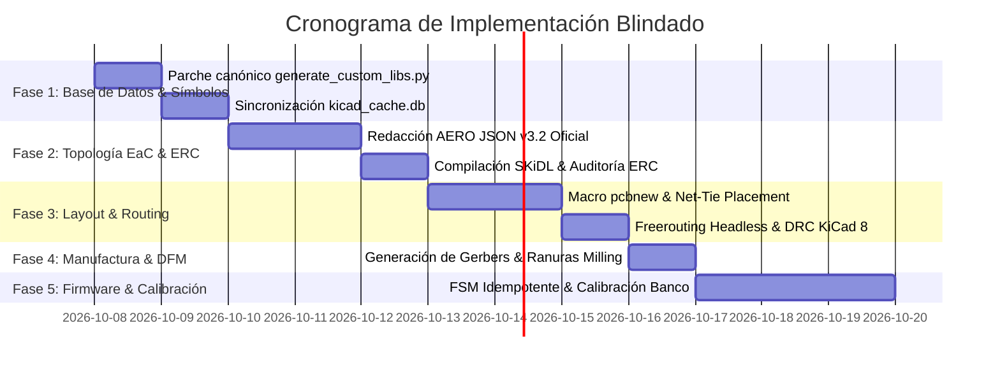

# PLAN MAESTRO DE IMPLEMENTACIÓN TÉCNICA: MONITOR DE ENERGÍA TRIFÁSICA (BLINDADO)
## Arquitectura de Grado Industrial: Microchip ATM90E36A (TQFP-48) + Espressif ESP32
### Pipeline Electronics-as-Code (EaC) & Zero-Geometry para KiCad 8
*Consolidación de Especialistas Alpha, Beta, Gamma + Auditoría y Correcciones del Crítico Aero*

---

## 1. RESUMEN EJECUTIVO Y VERIFICACIÓN METROLÓGICA

El presente **Plan Maestro de Implementación Blindado** unifica las propuestas técnicas de tres Ingenieros Especialistas (Alpha, Beta, Gamma) e integra las correcciones críticas emitidas por la auditoría implacable del **Crítico Aero (Red Team Watchdog)**.

El diseño cubre un monitor de energía eléctrica trifásica polifásica (3P4W / 3P3W / Split-phase) de clase metrológica **IEC 62053-22 Clase 0.5S / Clase 1**, operando bajo el paradigma **Zero-Geometry Hardware-as-Code (AERO JSON v3.2)** para KiCad 8.

```mermaid
graph TD
    subgraph AFE_Metrologico [Front-End Analógico ATM90E36A - TQFP-48 Oficial]
        CT[4x CT SCT-013-000\nBornera Industrial Tornillo] -->|Burden 13.0Ω 0.1% + TVS SMAJ6.0CA| RC_I[Filtro RC Diferencial Simétrico\nfc = 7.96 kHz]
        PT[3x Trafo AC-AC 230V->9V RMS\nBornera Paso 7.62 mm] -->|Divisor 100kΩ/3.3kΩ + Clamping BAV99| RC_V[Filtro RC Tensión\nfc = 15.9 kHz]
        RC_I --> ADCI[Pines 3-10: I1P/N, I2P/N, I3P/N, I4P/N]
        RC_V --> ADCV[Pines 13-18: V1P/N, V2P/N, V3P/N]
        XTAL[Cristal 16.384 MHz\nCL=18pF C0G] --> OSC[Pines 20/21: OSCI/OSCO]
        VREF_CAP[Capacitor 4.7µF MLCC + 100nF] --> VREF_PIN[Pin 11: VREF Oficial]
    end

    subgraph Aislamiento_Tierras [Partición de Tierras & Alimentación]
        AGND[Plano Analógico AGND\nPines 2 y 12] <-->|Net-Tie 0.5 mm Star Ground\nBajo ATM90E36A| DGND[Plano Digital DGND\nPines 19 y 32]
        LDO_ANA[LDO AFE Dedicado 3.3V\nAP2112K / TPS7A0533] --> AVDD[Pin 1: AVDD]
    end

    subgraph MCU_ESP32 [Controlador ESP32-WROOM-32E]
        SPI[Bus SPI 4-Wire Modo 3\nPines 34-37 ATM90E36A] <-->|R amortiguadoras 33Ω| ESP_SPI[GPIO18/19/23/5]
        NTC[Termistor NTC 10kΩ] -->|ESTRICTO| ADC1[GPIO34 / ADC1_CH6\nInmune a RF Wi-Fi]
        DS[Sensor DS18B20 1-Wire] --> GPIO16[GPIO16 Digital]
        WIFI[Transceptor Wi-Fi / MQTT]
        BULK[Capacitor Polímero 100µF Low-ESR] --> ESP_PWR[Riel 3.3V Digital]
    end

    subgraph Etapa_Potencia [Etapa de Relé & Conmutación Industrial]
        GPIO17[GPIO17] -->|Pull-down 4.7kΩ de Seguridad| OPTO[Optoacoplador PC817]
        OPTO --> DRV[MOSFET N 2N7002 / AO3400]
        DRV -->|Flyback Rápido UF4007/SS14| RELAY[Relé 12V Industrial]
        RELAY -->|Snubber 100Ω + 10nF X2 + MOV| MAINS[Carga de Potencia AC]
    end
```



---

## 2. ARQUITECTURA DEL FRONT-END ANALÓGICO (AFE) Y CORRECCIÓN DE PINOUT

### 2.1. Mapeo Oficial de Pines del ATM90E36A (TQFP-48)
*Tras la auditoría del Crítico, se descarta el pinout ficticio del repositorio y se adopta formalmente el estándar oficial de Microchip:*

| Pines | Nombre Oficial | Función / Acondicionamiento |
| :--- | :--- | :--- |
| **Pin 1** | `AVDD` | Alimentación analógica 3.3V filtrada por LDO dedicado / perla de ferrita. |
| **Pines 2, 12** | `AGND` | Masa analógica del AFE (conectada a plano AGND continuo). |
| **Pines 3, 4** | `I1P`, `I1N` | Entrada diferencial de corriente Fase A (Canal 1). |
| **Pines 5, 6** | `I2P`, `I2N` | Entrada diferencial de corriente Fase B (Canal 2). |
| **Pines 7, 8** | `I3P`, `I3N` | Entrada diferencial de corriente Fase C (Canal 3). |
| **Pines 9, 10** | `I4P`, `I4N` | Entrada diferencial de corriente Neutro (Canal 4 - Detección de Fugas). |
| **Pin 11** | `VREF` | **Salida de referencia de 1.20 V.** Desacoplada con $4.7\ \mu\text{F}$ X7R + $100\text{ nF}$ C0G a Pin 12 (`AGND`). Pistas $< 2\text{ mm}$. |
| **Pines 13, 14** | `V1P`, `V1N` | Entrada diferencial de tensión Fase A ($V_{1N}$ referenciado a AGND). |
| **Pines 15, 16** | `V2P`, `V2N` | Entrada diferencial de tensión Fase B ($V_{2N}$ referenciado a AGND). |
| **Pines 17, 18** | `V3P`, `V3N` | Entrada diferencial de tensión Fase C ($V_{3N}$ referenciado a AGND). |
| **Pines 19, 32**| `DGND` | Masa digital del núcleo y oscilador. |
| **Pines 20, 21**| `OSCI`, `OSCO` | Cristal fundamental de **16.384 MHz** con carga C0G y anillo de guarda. |
| **Pines 25, 26**| `IRQ0`, `IRQ1` | Salidas de interrupción / alarma (open-drain con pull-ups de $10\text{ k}\Omega$). |
| **Pin 27** | `WARNOUT` | Salida de advertencia de sobrecarga / subtensión. |
| **Pines 28-31**| `CF1`-`CF4` | Salidas de pulsos de energía activa/reactiva para calibración. |
| **Pin 33** | `DVDD` | Alimentación digital del núcleo 3.3V (desacoplo $100\text{ nF}$). |
| **Pines 34-37**| `CS`, `SCLK`, `SDI`, `SDO` | Bus SPI de 4 hilos (conectado a ESP32 con resistencias amortiguadoras de $33\ \Omega$). |
| **Pin 41** | `RESET` | Reset activo bajo con red RC ($10\text{ k}\Omega$ pull-up + $100\text{ nF}$ a DGND + BAT54). |
| **Pines 42, 43**| `PM0`, `PM1` | Amarrados rígidamente a `DGND` para forzar modo SPI 4-wire normal. |

---

### 2.2. Canales de Corriente (SCT-013-000) y Seguridad Anti-Arco
- **Sensor:** Transformador de corriente de núcleo partido SCT-013-000 ($100\text{ A} : 50\text{ mA}$ RMS, ratio $N = 2000$).
- **Conexión de Entrada Industrial:** **PROHIBIDO el uso de Jacks de audio de 3.5 mm**. Se especifican **borneras enchufables de tornillo industriales (paso 3.81 mm o 5.08 mm)**.
- **Protección contra Circuito Abierto:** Supresor TVS bidireccional ultrarrápido **SMAJ6.0CA** soldado directamente en los bornes de la PCB en paralelo con la resistencia burden. Limita de forma segura cualquier sobretensión inducida ($< 9.2\text{ V}$) si el cable del sensor sufre desconexión accidental bajo 100A de carga, salvando la vida del operario y la integridad del equipo.
- **Resistencia Burden Unificada ($R_b$):**
  - **$R_b = 13.0\ \Omega$ (0.1%, SMD 1206 Thin-Film, TCR $\le 25\text{ ppm/}^\circ\text{C}$)**.
  - A 100A nominal: $I_{sec\_pk} = 70.71\text{ mA}_{pk} \implies V_{diff\_pk} = 919.2\text{ mV}_{pk\_diff}$ ($\pm 459.6\text{ mV}_{pk}$ por terminal). Operación óptima al 91.9% del rango lineal ($\pm 500\text{ mV}_{pk}$).
  - A 120A sobrecarga: $\pm 551.5\text{ mV}_{pk} < 720\text{ mV}_{pk}$ (sin saturación de ADC).
  - Potencia a 120A: $46.8\text{ mW}$ sobre encapsulado 1206 (250 mW rating). Autocalentamiento $\Delta T < 1.5^\circ\text{C}$.
- **Filtro Antialiasing Simétrico:**
  - $R_1 = R_2 = 1.00\text{ k}\Omega$ (1% película metálica).
  - $C_{diff} = 10\text{ nF}$ (C0G/NP0 50V) $\implies f_{c,diff} \approx \mathbf{7.958\text{ kHz}}$.
  - $C_{cm1} = C_{cm2} = 1.0\text{ nF}$ a `AGND`.

---

### 2.3. Canales de Tensión y Distancias de Aislamiento
- **Aislamiento Primario:** Transformadores adaptadores externos de 230V CA a 9.0V RMS (IEC 61010-1 $> 3.75\text{ kV}_{RMS}$).
- **Bornera de Conexión de Red:** Bornera de tornillo con **paso de 7.62 mm** (o bornera de 5.08 mm con *Pin Skipping* desierto intermedio). Garantiza físicamente un **clearance en aire $\ge 6.0\text{ mm}$ y creepage $\ge 6.3\text{ mm}$**, cumpliendo rigurosamente la norma IEC 61010-1 CAT III.
- **Divisor Resistivo de Tensión:**
  - $R_{top} = 100\text{ k}\Omega$ ($2 \times 49.9\text{ k}\Omega\ 0.1\%$ 0805 en serie para alta rigidez dieléctrica).
  - $R_{bot} = 3.30\text{ k}\Omega$ ($0.1\%$, 0805). Factor de atenuación: $\alpha = 0.03194$.
  - Tensión en ADC a 9V RMS nominal: $406.6\text{ mV}_{pk}$. En sobretensión máxima (+25% vacío, +10% red): $514.2\text{ mV}_{pk} < 720\text{ mV}_{pk}$.
- **Filtro RC & Clamping:** $R = 1.00\text{ k}\Omega$, $C = 10\text{ nF}$ C0G ($f_c \approx 15.9\text{ kHz}$) con par de diodos **BAV99** clampados a 3.3V analógico y AGND.

---

## 3. BLINDAJE DE SILICIO DEL ESP32, IDEMPOTENCIA Y LOAD SHEDDING

### 3.1. Idempotencia de Arranque ($f(f(x)) = f(x)$)
1. **Transitorios y Anti-Chattering en Etapa de Relé:**
   - Durante el arranque o brownout del ESP32, GPIO17 se encuentra en alta impedancia (Hi-Z).
   - Se incorpora un **pull-down físico de $4.7\text{ k}\Omega$ a GND** en el ánodo del PC817 (lado ESP32).
   - Esto garantiza que el relé jamás conmute espuriamente durante reinicios del microcontrolador.
2. **Máquina de Estados Finita (FSM) Idempotente para el ATM90E36A:**
   - Dado que el ATM90E36A no posee memoria no volátil, el firmware del ESP32 implementa una inicialización atómica:
     ```c
     // Verificación de Checksum de Calibración
     uint16_t cs0_read = atm90_read_register(REG_CS0);
     if (cs0_read != golden_checksum_nvs) {
         atm90_write_calibration_block(&golden_calibration_profile);
         atm90_verify_checksums();
     }
     ```
   - Reinicios intempestivos o caídas transitorias de tensión restauran automáticamente la calibración sin intervención humana y sin corromper registros de energía acumulada.

### 3.2. Load Shedding & Prevención de Thundering Herd
1. **Política de Reconexión Wi-Fi / MQTT:**
   - Ante el retorno del suministro eléctrico tras un apagón masivo, se aplica **Backoff Exponencial con Jitter Decorrelacionado**:
     $$T_{backoff} = \min(300\text{ s}, 5\text{ s} \times 2^{\text{retries}}) + \text{rand}(0, 15\text{ s})$$
   - Previene el colapso de la red Wi-Fi y los brokers MQTT industriales (*Thundering Herd*).
2. **Drop-Tail Load Shedding en Telemetría:**
   - Si se pierde la conectividad de red, el sistema descarta inmediatamente las muestras instantáneas de alta frecuencia (tensión y corriente RMS instantáneas) y preserva **estrictamente en memoria NVS** los acumuladores totales de energía activa y reactiva (kWh / kVARh).

### 3.3. Estabilidad de Alimentación y Supresión de Brownout
1. **LDO Analógico Dedicado:** Regulador LDO de ultra-bajo ruido independiente para el AFE (AP2112K-3.3 o TPS7A0533, PSRR $> 65\text{ dB}$).
2. **Capacitancia Bulk de Polímero:** Condensador de polímero de aluminio de **$100\ \mu\text{F}\ 6.3\text{V}$ Low-ESR** en el riel de 3.3V del ESP32. Absorbe los picos de conmutación de RF Wi-Fi ($\sim 500\text{ mA}$, flancos $ns$), eliminando caídas de tensión inducidas y bucles de reinicio por brownout.

### 3.4. Guardrails de Sensores y Etapa de Relé
- **NTC 10 kΩ:** Conectado **ESTRICTAMENTE a GPIO34 (ADC1_CH6)**. Totalmente desacoplado de las rutinas de calibración SAR2 del transceptor Wi-Fi.
- **DS18B20 1-Wire:** Conectado a **GPIO16**, con resistencia pull-up externa de $4.7\text{ k}\Omega$ a 3.3V.
- **Diodo Flyback del Relé:** Se reemplaza el 1N4007 por un diodo **UF4007 ultrafast** ($t_{rr} \le 75\text{ ns}$) o Schottky **SS14/SS34**.
- **Red Snubber AC del Relé:** Reducción de la capacitancia a **$10\text{ nF}\ 275\text{VAC}$ Clase X2** en serie con $100\ \Omega\ 1\text{W}$, reduciendo la corriente de fuga en reposo a menos de $0.72\text{ mA RMS}$ (eliminando el parpadeo fantasma en luminarias LED).

---

## 4. PLAN DE TRABAJO ESTRUCTURADO Y MATRIZ DE RIESGOS



### Hitos Objetivos y Criterios de Aceptación:
1. **Hito 1 (Librerías Validadas):** `generate_custom_libs.py` corregido con los 48 pines canónicos del ATM90E36A. `sync_kicad_libs.py` ejecutado. `shadow_interrogator.py` valida 100% de componentes con 0 errores.
2. **Hito 2 (Topología EaC & ERC):** `aero_board.net` compilado sin warnings ni redes flotantes en `aero_orchestrator.erc`.
3. **Hito 3 (Layout Físico & DRC):** 100% de pistas ruteadas por Freerouting. DRC de KiCad 8 superado con 0 violaciones de aislamiento ($\ge 6.0\text{ mm}$ en HV) y ranuras de fresado de 1.5 mm validadas en `Edge.Cuts`.
4. **Hito 4 (Firmware & Banco de Ensayos):** FSM idempotente probada ante 100 cortes abruptos de alimentación; telemetría NTC estable bajo ráfagas continuas de Wi-Fi; error metrológico $< 0.5\%$ (Clase 0.5S) verificado con carga patrón.

---
*Fin del Plan Maestro Blindado.*
