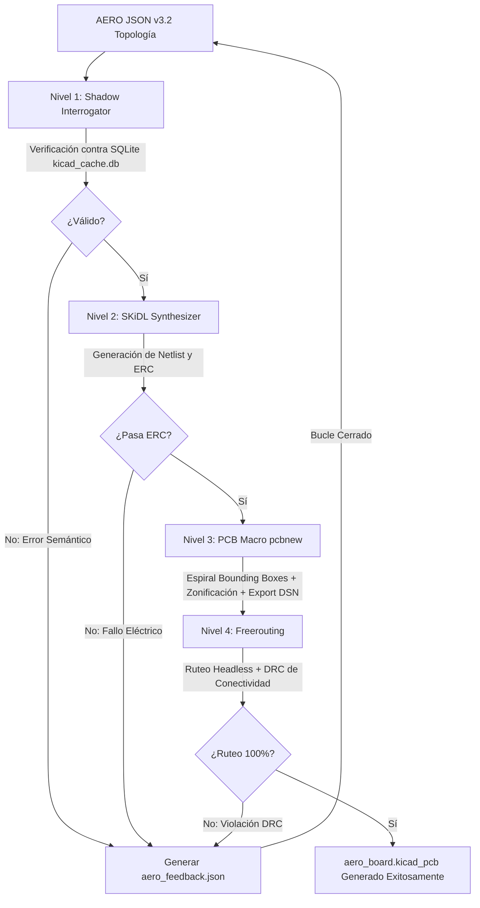

# PROPUESTA TÉCNICA Y PLAN DE IMPLEMENTACIÓN: MONITOR DE ENERGÍA TRIFÁSICA
## Arquitectura ATM90E36A + ESP32 bajo Flujo Zero-Geometry Hardware-as-Code (KiCad 8)

**Autor:** Senior Electronic Engineer & Hardware Architect  
**Framework:** AERO Zero-Geometry Pipeline (AERO JSON v3.2 / SKiDL / pcbnew / Freerouting)  
**Licencia:** Apache-2.0 — Rengil Multiservicios C.A. / Enjerbeth  
**Fecha:** Octubre 2026  

---

## 1. RESUMEN EJECUTIVO Y OBJETIVOS DE ARQUITECTURA

El presente documento define la arquitectura integral de hardware y el plan de implementación para el desarrollo de un **Monitor de Energía Eléctrica Trifásica de Alta Precisión**, basado en el AFE (Analog Front-End) metrológico **Microchip ATM90E36A** (encapsulado TQFP-48) y el SoC de comunicaciones **Espressif ESP32** (ESP32-WROOM-32E / ESP32-S3).

### Objetivos Clave de Ingeniería:
1. **Topología Eléctrica Trifásica Flexible:** Soporte nativo para configuraciones trifásicas tetrapolares (3P4W - 3 Fases + Neutro), trifásicas tripolares (3P3W), sistemas bifásicos ("split-phase") y monofásicos.
2. **Cumplimiento Metrológico Clase 0.5S / Clase 1:** Rango dinámico de corriente de hasta 6000:1 mediante muestreo diferencial de 4 canales de corriente ($I_A, I_B, I_C, I_N$) con transformadores de corriente externos tipo pinza (SCT-013-000, 100A/50mA) y 3 canales de tensión ($V_A, V_B, V_C$) aislados galvánicamente vía transformadores AC-AC (230V a 9V/12V RMS).
3. **Control y Supervisión Industrial:** Bloque de conmutación de relés industriales optoacoplados con supresión flyback y monitoreo térmico redundante (termistor NTC 10kΩ asignado estrictamente a ADC1 + bus digital DS18B20 1-Wire).
4. **Desarrollo Determinista "Zero-Geometry" (Electronics-as-Code):** Erradicación total de la alucinación geométrica de los modelos LLM mediante la adopción estricta del contrato topológico **AERO JSON v3.2**, delegando el cálculo de coordenadas, despejes dieléctricos (clearance/creepage $\ge 6\text{ mm}$) y enrutamiento al backend automatizado (Shadow Interrogator $\rightarrow$ SKiDL Synthesizer $\rightarrow$ pcbnew Macro $\rightarrow$ Freerouting).

---

## 2. EVALUACIÓN DEL ESQUEMÁTICO Y CONSIDERACIONES DE SEÑAL MIXTA

```
+---------------------------------------------------------------------------------------------------+
|                                 ARQUITECTURA DE DOMINIOS MIXTOS                                   |
|                                                                                                   |
|  [ ALTA TENSIÓN AC: 230V / 400V CAT III ]                                                        |
|         |                                                                                         |
|         +--> Transf. AC-AC (Galv. Isol. 3.75 kV) --> [ Divisores + Filtro RC ]                   |
|         |                                                      |                                  |
|         +--> Pinzas CT SCT-013-000 (Aisladas) -----> [ Burden + Filtro RC Diff ]                  |
|                                                                |                                  |
|  ==================== AISLAMIENTO Y BARRERA DE ENERGÍA / CORTES DIELECTRICOS ===================  |
|                                                                |                                  |
|  [ DOMINIO ANALÓGICO AFE (AGND / AVDD 3.3V) ]                 v                                  |
|         +-------------------------------------------------------------+                           |
|         |                 ATM90E36A (TQFP-48)                         |                           |
|         |  * VREF Int (1.185V) + 100nF/10uF                           |                           |
|         |  * Cristal 16.384 MHz + 18pF CL                             |                           |
|         |  * 4x Canales I (Diff) | 3x Canales V (Ref VN)              |                           |
|         +-------------------------------------------------------------+                           |
|                      |  SPI (MISO, MOSI, SCK, CS)                                                 |
|                      |  IRQ0, IRQ1, WARNOUT                                                       |
|                      +-----------------------+                                                    |
|                                              |                                                    |
|  ==================== STAR GROUND / FERRITE BEAD (AGND <-> DGND) ================================  |
|                                              |                                                    |
|  [ DOMINIO DIGITAL & CONTROL (DGND / DVDD 3.3V) ]                                                 |
|         +------------------------------------+------------------------+                           |
|         |                                    |                        |                           |
|         v                                    v                        v                           |
|  +-------------------+              +------------------+     +-------------------+                |
|  |   ESP32 SoC       |              | NTC 10k (ADC1)   |     | Opto PC817        |                |
|  | (Wi-Fi + BLE)     |              | DS18B20 (1-Wire) |     | Driver Relé 12V   |                |
|  +-------------------+              +------------------+     +-------------------+                |
|                                                                                                   |
+---------------------------------------------------------------------------------------------------+
```

### 2.1. Arquitectura del AFE Metrológico (ATM90E36A en TQFP-48)

El ATM90E36A es un procesador de señal digital (DSP) y convertidor analógico-digital de señal mixta de alta precisión. Su operación estable demanda una separación rigurosa entre dominios analógicos y digitales:

1. **Pines de Alimentación y Referencia:**
   - **AVDD (Pines 7, 19):** Alimentación analógica de 3.3V. Debe filtrarse a partir del riel de 3.3V general mediante una perla de ferrita de alta impedancia a alta frecuencia ($600\ \Omega\ @\ 100\text{ MHz}$, e.g. Murata BLM18PG601SN1) con desacoplos de $100\text{ nF}$ cerámicos X7R inmediatamente adyacentes a cada pin, respaldados por un capacitor de tantalio o cerámico de $10\ \mu\text{F}$.
   - **DVDD (Pin 32):** Alimentación del núcleo digital e interfaces I/O a 3.3V, desacoplado con $100\text{ nF}$ cerámico.
   - **VREF (Pin 1):** Tensión de referencia interna de banda prohibida ($1.185\text{ V}$ típico, deriva térmica $< 10\text{ ppm/}^\circ\text{C}$). Este pin es hipersensible a ruido de conmutación. Debe desacoplarse con un condensador cerámico de $100\text{ nF}$ en paralelo con $4.7\ \mu\text{F}$ de muy bajo ESR directamente hacia **AGND** con trazas de ancho generoso ($> 0.35\text{ mm}$) y longitud mínima ($< 2.5\text{ mm}$).
   - **AGND (Pin 2) y DGND (Pin 12):** Planos de tierra física segregados.

2. **Base de Tiempo (Cristal de Cuarzo):**
   - **OSCI / OSCO (Pines 30, 31):** Cristal fundamental de **16.384 MHz** (frecuencia requerida por el PLL y moduladores sigma-delta internos).
   - Capacitores de carga $C_L$: Para un cristal con especificación de carga $C_{L\_crystal} = 12\text{ pF}$ y una capacitancia parásita estimada de pista $C_{stray} \approx 3\text{ pF}$:
     $$C_1 = C_2 = 2 \times (C_{L\_crystal} - C_{stray}) = 2 \times (12 - 3) = 18\text{ pF}$$
   - El circuito resonador debe rodearse con un anillo de guarda (*guard ring*) conectado a DGND y no albergar ninguna pista digital rápida en capas adyacentes.

3. **Canales de Muestreo de Corriente:**
   - Cuatro canales diferenciales dedicados: Fase A (`I1P`, `I1N`), Fase B (`I2P`, `I2N`), Fase C (`I3P`, `I3N`) y Neutro (`I4P`, `I4N`).
   - El canal de neutro es imperativo para la detección de desbalance de fases, corrientes armónicas de neutro (triplens) y detección de fraude eléctrico.
   - Las señales ingresan en modo puramente diferencial flotante respecto al secundario del CT y se referencian mediante una red simétrica hacia AGND.

4. **Canales de Muestreo de Tensión:**
   - Tres canales: Fase A (`V1P`, `V1N`), Fase B (`V2P`, `V2N`), Fase C (`V3P`, `V3N`).
   - Conexión: Las entradas `V1N`, `V2N`, `V3N` se conectan internamente o externamente al nodo de referencia analógica común `VN` (conectado a AGND), permitiendo muestreo pseudo-diferencial contra el neutro medido.

---

### 2.2. Interfaz Digital con ESP32 y Líneas de Interrupción

1. **Bus SPI a 3.3V (Modo SPI 3 o Modo 0):**
   - **SCK (GPIO18 ESP32 $\rightarrow$ Pin 35/40 ATM90E36A):** Reloj de comunicación maestro (típicamente configurado a 1.0 MHz – 2.0 MHz; el ATM90E36A tolera hasta 2.5 MHz).
   - **MOSI / SDI (GPIO23 ESP32 $\rightarrow$ Pin 36/39 ATM90E36A):** Datos hacia el AFE (transferencias de 16 bits de dirección/control seguidas de 16 bits de datos).
   - **MISO / SDO (GPIO19 ESP32 $\leftarrow$ Pin 37/38 ATM90E36A):** Lectura de registros.
   - **CS (GPIO5 ESP32 $\rightarrow$ Pin 34 ATM90E36A):** Chip Select activo en nivel bajo.
   - *Resistencias amortiguadoras serie (Damping Resistors):* Insertar resistencias de $22\ \Omega$ a $33\ \Omega$ en SCK, MOSI y CS para extinguir armónicos por reflexiones de alta frecuencia y limitar la tasa de subida (*slew-rate ringing*).

2. **Líneas de Eventos e Interrupción Metrológica:**
   - **IRQ0 (Pin 28 $\rightarrow$ GPIO16 ESP32):** Alarma de sobrecorriente, subtensión y fallo de fase. Colector abierto; requiere resistencia pull-up de $10\text{ k}\Omega$ a 3.3V.
   - **IRQ1 (Pin 29 $\rightarrow$ GPIO17 ESP32):** Alarma de factor de potencia crítico, cruce por cero y desbordamiento de energía. Colector abierto con pull-up de $10\text{ k}\Omega$.
   - **WARNOUT (Pin 27 $\rightarrow$ GPIO4/GPIO21 ESP32):** Salida de advertencia de degradación o tensión límite (pull-up $10\text{ k}\Omega$).
   - **CF1 – CF4 (Pines 23-26):** Salidas de pulsos de energía configurables (energía activa, reactiva, aparente o fundamental) para verificación metrológica en banco con fotocélulas calibradoras.

---

### 2.3. Subcircuito de Sensores de Temperatura

1. **Termistor NTC 10kΩ (Monitoreo Térmico de la Placa / Bornes):**
   - Configuración: Divisor resistivo alimentado desde el riel regulado de 3.3V.
   - $R_{pullup} = 10\text{ k}\Omega\ (\pm 0.1\%,\ 25\text{ ppm/}^\circ\text{C})$ en serie hacia el termistor NTC ($10\text{ k}\Omega\ @\ 25^\circ\text{C},\ \beta_{25/85} = 3950\text{ K}$) conectado a GND.
   - Filtro de filtrado: Capacitor de $100\text{ nF}$ cerámico en paralelo con el NTC para rechazar ruido térmico y armónicos de conmutación.
   - **REGLA CRÍTICA DE ASIGNACIÓN AL ESP32 (ADC1 vs ADC2):**
     El nodo del divisor del NTC debe conectarse **ESTRICTAMENTE a un pin de ADC1** (GPIO32, GPIO33, GPIO34, GPIO35, GPIO36 o GPIO39).
     > [!CAUTION] Conflicto de Hardware Indiscutible (ESP32 ADC2)
     > El bloque interno SAR ADC2 del ESP32 es compartido por el driver de hardware del transceptor Wi-Fi / Bluetooth. Tan pronto como la pila de red Wi-Fi se inicializa en ESP-IDF o ESPHome, el hardware bloquea ADC2 para ejecutar calibraciones RF periódicas (`PHY RF calibration`). Cualquier intento de lectura sobre pines de ADC2 (GPIO0, 2, 4, 12-15, 25-27) mientras Wi-Fi está habilitado falla catastróficamente o arroja lecturas espurias de 0V/4095. La asignación a **GPIO34** (ADC1_CH6, pin de solo entrada, inmune a strapping) es obligatoria.

2. **Sensor Digital DS18B20 (Monitoreo de Transformador / Ambiente Remoto):**
   - Interfaz 1-Wire conectada a GPIO22 o GPIO4 del ESP32.
   - Requiere resistencia pull-up rígida de $4.7\text{ k}\Omega$ hacia 3.3V y un condensador cerámico de desacoplo de $100\text{ nF}$ soldado en los propios terminales $V_{DD}$ y GND del sensor remoto para prevenir caídas de tensión durante la conversión térmica (que consume hasta $1.5\text{ mA}$ durante $750\text{ ms}$).

---

### 2.4. Subcircuito de Accionamiento de Relés Industriales

Para habilitar la desconexión de cargas o señalización de disparo sin comprometer la inmunidad electromagnética del procesador:

```
 ESP32 (3.3V Domain)         ISOLATION BARRERA          RELAY COIL DOMAIN (12V/5V)
 
 GPIO (ESP32) ---[ 330R ]---+                      +12V_RELAY 
                            |                           |
                          [ A ]                         +----------+
                         (PC817)                        |          |
                          [ K ]                       [COIL]     [1N4007] (Flyback)
                            |                           |          |
 DGND ----------------------+                           +----+-----+
                                                             |
                                      +12V_RELAY             | Drain
                                          |                  |
                                       [10k PU]        +-----+
                                          |            |  NMOS (2N7002 / AO3400)
                              +-----------+--[ 1k R_G ]+--|Gate
                              |                        |
                           Collector                   [10k PD]
                           (PC817)                     |
                           Emitter                     | Source
                              |                        |
                          RELAY_GND -------------------+----------------- RELAY_GND
```

1. **Aislamiento Óptico Galvánico (PC817):**
   - El LED emisor del optoacoplador PC817 se excita desde un GPIO del ESP32 mediante una resistencia en serie:
     $$R_{in} = \frac{V_{OH} - V_F}{I_F} = \frac{3.3\text{ V} - 1.2\text{ V}}{6.3\text{ mA}} \approx 330\ \Omega$$
   - Esto suministra $6.3\text{ mA}$ al LED infrarrojo, garantizando saturación completa del fototransistor con CTR $> 100\%$.
2. **Etapa de Potencia MOSFET N-Channel (2N7002 / AO3400):**
   - Se utiliza un transistor MOSFET de canal N (2N7002 para bobinas de hasta $200\text{ mA}$, o AO3400 para relés industriales pesados de hasta $2\text{ A}$).
   - **Resistencia Serie de Compuerta ($R_G = 1\text{ k}\Omega$):** Limita la corriente de carga parásita de compuerta ($C_{iss}$) y amortigua oscilaciones LC parásitas.
   - **Resistencia Pull-Down de Compuerta ($R_{PD} = 10\text{ k}\Omega$):** Garantiza que la compuerta se mantenga referenciada a tierra de forma determinista durante el arranque o flotación del optoacoplador.
3. **Supresión Inductiva Flyback:**
   - En paralelo con la bobina del relé se integra un diodo ultrarrápido o rectificador robusto (1N4007 / 1N4148 / Schottky SS14), con el cátodo orientado hacia $+V_{relay}$ y ánodo hacia el drenador del MOSFET.
   - Suprime la f.e.m. autoinducida:
     $$V_{trans} = -L_{coil} \cdot \frac{di}{dt}$$
     evitando la avalancha destructiva de la juntura del MOSFET.
4. **Dominio de Potencia Separado:**
   - La alimentación de relés ($+12\text{V\_RELAY}$ o $+5\text{V\_RELAY}$) y su retorno de tierra (`RELAY_GND`) no deben compartir pistas de retorno con `AGND` ni `DGND`, eliminando rebotes de tierra (*ground bounce*) inducidos por la conmutación de la armadura del relé.

---

### 2.5. Partición de Tierras y Retorno de Corriente (Señal Mixta)

1. **Separación Física de Planos:**
   - **Plano AGND:** Ubicado estrictamente bajo el ATM90E36A, las redes burden de los CTs, divisores de tensión AC y condensador de referencia VREF.
   - **Plano DGND:** Cubre el ESP32, antena RF, osciladores, transceptor USB-UART y convertidores DC-DC buck.
2. **Punto de Unión en Estrella (Star Ground):**
   - Ambos planos deben interconectarse en un **ÚNICO PUNTO FÍSICO** directamente en la huella del ATM90E36A (entre el Pin 2 AGND y Pin 12 DGND), o acoplados mediante una perla de ferrita de alta corriente (0805, saturación $> 500\text{ mA}$) o puente de soldadura (*net-tie* de $0\ \Omega$).
   - Esto bloquea la circulación de corrientes de retorno digitales de alta frecuencia (como las ráfagas de 2.4 GHz de Wi-Fi de hasta $300\text{ mA}$) a través del sensible plano analógico de metrología.

---

## 3. ESTRATEGIA DE DIMENSIONAMIENTO Y PROTECCIONES (CÁLCULOS MATEMÁTICOS)

### 3.1. Dimensionamiento de la Resistencia Burden ($R_b$) para Sensor SCT-013-000

El transformador de corriente no invasivo **YHDC SCT-013-000** es un sensor de relación $2000:1$, especificado para una corriente primaria nominal de $100\text{ A RMS}$ y una corriente secundaria nominal de $50\text{ mA RMS}$.

```
    Primary Current: I_prim = 100A RMS
                |
          +-----o-----+  (SCT-013-000, Ratio N = 2000:1)
          |           |
       Secondary: I_sec = 50mA RMS (I_pk = 70.71 mA)
          |           |
          +-----+-----+
                |
         +------+------+
         |             |
        [R_b]         [TVS] (SMAJ3.3CA Clamp)
         |             |
         +------+------+
                |
    Diff. Voltage: V_diff(t) = I_sec(t) * R_b
```

#### Parámetros del ATM90E36A:
- Ganancia programable del PGA en canales de corriente: $\times 1, \times 2, \times 4$.
- Rango de tensión diferencial pico máxima en entradas analógicas para ganancia $\times 1$:
  $$V_{ADC\_max\_pk} = \pm 720\text{ mV peak} \quad (V_{ADC\_max\_RMS} \approx 509\text{ mV RMS})$$

#### Análisis de Selección de $R_b$:
1. **Caso 1: Rango Completo hasta 100A RMS (Factor de Cresta Senoidal = $\sqrt{2}$)**
   $$I_{sec\_pk} = 50\text{ mA} \times \sqrt{2} \approx 70.71\text{ mA peak}$$
   $$R_{b\_teorica} = \frac{V_{ADC\_max\_pk}}{I_{sec\_pk}} = \frac{0.720\text{ V}}{0.07071\text{ A}} \approx 10.18\ \Omega$$
   - Con $R_b = 10\ \Omega\ (1\%)$:
     $$V_{diff\_RMS} = 50\text{ mA} \times 10\ \Omega = 500\text{ mV RMS} \implies V_{diff\_pk} = 707.1\text{ mV peak} < 720\text{ mV}$$
   - Cobertura: Permite medir hasta $101.8\text{ A RMS}$ antes del recorte digital del convertidor ADC.

2. **Caso 2: Aplicación Residencial / Comercial Típica (Rango hasta 46A - 50A RMS, $R_b = 22\ \Omega$)**
   - Utilizado en las placas de referencia CircuitSetup y OpenEnergyMonitor.
   - Con $R_b = 22\ \Omega$:
     Para $I_{prim} = 46\text{ A RMS}$, la corriente secundaria es:
     $$I_{sec} = \frac{46\text{ A}}{2000} = 23\text{ mA RMS}$$
     $$V_{diff\_pk} = 23\text{ mA} \times \sqrt{2} \times 22\ \Omega = 715.6\text{ mV peak} \approx 720\text{ mV peak}$$
   - **Beneficio Metrológico:** Multiplica la resolución efectiva del convertidor ADC por un factor de $2.2\times$, incrementando drásticamente la relación señal/ruido (SNR) para cargas ligeras (e.g., luminarias LED en reposo de 5W - 50W).

3. **Caso 3: Subcircuitos de Baja Potencia ($R_b = 33\ \Omega$)**
   - Límite de saturación:
     $$I_{prim\_max} = \frac{720\text{ mV}}{\sqrt{2} \times 33\ \Omega} \times 2000 \approx 30.8\text{ A RMS}$$
   - Ideal para circuitos derivados de tomas de corriente protegidos por disyuntores de 16A o 20A.

#### Cálculo de Disipación de Potencia en $R_b$:
Para la condición más exigente ($R_b = 33\ \Omega$ a corriente máxima $I_{sec} = 50\text{ mA RMS}$):
$$P_{Rb} = I_{sec}^2 \cdot R_b = (0.050\text{ A})^2 \times 33\ \Omega = 0.0825\text{ W} = 82.5\text{ mW}$$
- **Recomendación de Componente:** Resistencia en encapsulado SMD 0805 (nominal $125\text{ mW}$) o SMD 1206 (nominal $250\text{ mW}$), tolerancia **$\pm 0.1\%$**, coeficiente de temperatura de **$\pm 25\text{ ppm/}^\circ\text{C}$** (película fina / Thin Film). Esto previene derivas de calibración asociadas al autocalentamiento Joule del componente.

#### Protección de Entradas de Corriente:
- En paralelo con cada resistencia burden se debe soldar un supresor de transitorios TVS bidireccional de baja capacitancia (e.g., **SMAJ3.3CA** o red antiparalelo de diodos Schottky **BAT54S**).
- Si el conector jack de 3.5mm de la pinza se desacopla o se abre accidentalmente la resistencia burden, el núcleo de ferrita de la pinza generaría impulsos inductivos de alta tensión ($> 100\text{ V}$) capaces de destruir instantáneamente el AFE. El diodo TVS clampa la tensión diferencial a valores seguros ($< \pm 1.5\text{ V}$).

---

### 3.2. Dimensionamiento del Divisor de Tensión AC

Para la medición de tensión se descarta el acoplamiento resistivo directo a la red eléctrica para garantizar el aislamiento galvánico integral de la placa, empleando transformadores de tensión externos tipo adaptador de pared AC-AC (e.g., Greenlee / Ideal / ZMPT101B / Transformador estándar 230V a 9V o 12V RMS).

```
   Mains 230V RMS (Phase-Neutral)
             |
       +-----o-----+  Transformer AC-AC (Galvanic Isolation 3.75 kV)
       |     |     |
       +-----o-----+
             |
   Secondary: 9V RMS nominal (V_unloaded = 10.35V RMS, V_pk = 14.64V)
             |
             +-----[ R_top = 100k (2x 49.9k) ]----+
                                                  |
                                                  +-----[ R_filter = 1k ]---> V_xP (ADC)
                                                  |                               |
                                                [R_bot = 3.9k]                 [10nF C_filter]
                                                  |                               |
                                                 AGND ----------------------------+ (VN)
```

#### Análisis Numérico:
1. **Tensión Secundaria del Transformador:**
   - Tensión nominal secundaria: $9.0\text{ V RMS}$.
   - Regulación típica de carga en transformadores de baja potencia ($< 5\text{ VA}$): $+15\%$ en vacío:
     $$V_{sec\_vacío} = 9.0\text{ V} \times 1.15 = 10.35\text{ V RMS}$$
   - Condición de sobretensión en red (+10% según norma IEC 60038, hasta 253V):
     $$V_{sec\_max\_RMS} = 10.35\text{ V} \times 1.10 = 11.385\text{ V RMS}$$
   - Tensión máxima de pico esperada en el secundario:
     $$V_{sec\_pk} = 11.385\text{ V} \times \sqrt{2} \approx 16.10\text{ V peak}$$

2. **Cálculo de la Red Divisora ($R_{top}$ y $R_{bot}$):**
   - El canal de tensión del ATM90E36A admite hasta $\pm 720\text{ mV peak}$. Se dimensiona para un techo conservador de $V_{ADC\_target\_pk} \le 500\text{ mV peak}$ para garantizar linealidad total en el ADC.
   - Relación de división requerida:
     $$\text{Ratio} = \frac{V_{ADC\_target\_pk}}{V_{sec\_pk}} = \frac{0.500\text{ V}}{16.10\text{ V}} \approx 0.03105$$
   - Seleccionando $R_{top} = 100\text{ k}\Omega$ (implementada como dos resistencias en serie de $49.9\text{ k}\Omega\ 0.1\%$ para soportar tensión dieléctrica y disipación):
     $$\frac{R_{bot}}{R_{top} + R_{bot}} = 0.03105 \implies R_{bot} \approx \frac{0.03105 \times 100\text{ k}\Omega}{1 - 0.03105} \approx 3.20\text{ k}\Omega$$
   - **Valor comercial estándar E96:** $R_{bot} = 3.3\text{ k}\Omega\ (0.1\%)$ o $3.9\text{ k}\Omega\ (0.1\%)$.
   - Con $R_{bot} = 3.3\text{ k}\Omega$:
     $$\text{Ratio}_{real} = \frac{3.3}{100 + 3.3} = 0.03194$$
     Para 9V RMS nominal ($12.73\text{ Vpk}$):
     $$V_{ADC\_nom\_pk} = 12.73\text{ V} \times 0.03194 = 406.6\text{ mV peak} \quad (287.5\text{ mV RMS})$$
     Para condición extrema de sobretensión ($16.10\text{ Vpk}$):
     $$V_{ADC\_max\_pk} = 16.10\text{ V} \times 0.03194 = 514.2\text{ mV peak} < 720\text{ mV}$$
   - Margen de seguridad: El sistema tolera transitorios de tensión de hasta un $+40\%$ sobre la red antes de saturar el convertidor.

---

### 3.3. Filtros Anti-Aliasing Pasa-Bajos RC

Toda entrada analógica al modulador Sigma-Delta del ATM90E36A (frecuencia de sobremuestreo del modulador $f_s \approx 2.048\text{ MHz}$) requiere un filtro anti-aliasing pasivo de primer orden para atenuar ruido de conmutación de RF y prevenir el plegamiento espectral (*aliasing*).

1. **Canales de Corriente (Filtro RC Diferencial):**
   - Configuración: Dos resistencias simétricas de $R = 1.0\text{ k}\Omega\ (0.1\%)$ en serie con las ramas P y N, un condensador diferencial $C_{diff} = 10\text{ nF}$ (cerámico NPO/C0G) entre P y N, y dos condensadores de modo común $C_{cm} = 1.0\text{ nF}$ de cada rama hacia AGND.
   - Frecuencia de corte diferencial:
     $$f_{c\_diff} = \frac{1}{2 \pi \cdot (2R) \cdot C_{diff}} = \frac{1}{2 \pi \cdot (2000\ \Omega) \cdot (10 \times 10^{-9}\text{ F})} \approx 7957.7\text{ Hz} \approx 8\text{ kHz}$$
   - Atenuación de armónicos: A la frecuencia fundamental de red ($50\text{ Hz}$ / $60\text{ Hz}$), la atenuación es despreciable ($< 0.001\text{ dB}$).
   - Desplazamiento de fase a $50\text{ Hz}$:
     $$\theta = \arctan\left(\frac{f}{f_c}\right) = \arctan\left(\frac{50}{7957.7}\right) \approx 0.36^\circ$$
   - Compensación: Este ínfimo desfase de $0.36^\circ$ es perfectamente lineal y se calibra digitalmente a cero en los registros de ajuste de fase del ATM90E36A (`PLconst`, `AdjStart`).

2. **Canales de Tensión (Filtro RC Monopolar contra AGND):**
   - Resistencia en serie $R = 1.0\text{ k}\Omega\ (0.1\%)$, condensador $C = 10\text{ nF}$ C0G conectado a `VN` / `AGND`.
   - Frecuencia de corte:
     $$f_{c\_volt} = \frac{1}{2 \pi \cdot R \cdot C} = \frac{1}{2 \pi \cdot (1000\ \Omega) \cdot (10 \times 10^{-9}\text{ F})} \approx 15915\text{ Hz} \approx 15.9\text{ kHz}$$
   - Desplazamiento de fase a $50\text{ Hz}$:
     $$\theta = \arctan\left(\frac{50}{15915}\right) \approx 0.18^\circ$$

---

### 3.4. Supresión de Transitorios y Seguridad Dieléctrica (IEC 61010-1 / IEC 60664-1)

1. **Aislamiento de Alta Tensión en PCB:**
   - La tensión fase-fase en redes trifásicas industriales alcanza $400\text{ V RMS}$ nominales ($565\text{ V peak}$).
   - Según las normas internacionales **IEC 61010-1** e **IEC 60664-1** para Categoría de Sobretensión **CAT III 300V / CAT II 600V**, Grado de Contaminación 2 y Grupo de Materiales III (sustrato FR4 estándar con CTI $\ge 175$):
     - **Clearance mínimo en aire:** $\ge 3.0\text{ mm}$.
     - **Creepage mínimo en superficie:** $\ge 6.3\text{ mm}$.
   - **Solución Física Obligatoria en Layout:**
     Inclusión de ranuras de aislamiento fresadas (*isolation routing slots*) de ancho $\ge 1.5\text{ mm}$ entre las bornas de conexión de red AC y las áreas de señal de baja tensión, forzando una trayectoria en aire que satisface con creces los $8\text{ mm}$ de aislamiento reforzado.

2. **Protección Primaria contra Sobretensiones:**
   - Varistores de Óxido Metálico (MOV) de $14\text{ mm}$ (e.g., **14D431K** para 230V RMS, tensión de clamping $710\text{ V}$) entre cada Fase y Neutro.
   - Fusibles de protección rearmables PTC o fusibles cerámicos ultrarrápidos (e.g., 250V / 500mA) aguas arriba de cada varistor para prevenir riesgos de ignición en caso de degradación térmica del MOV por transitorios sostenidos.

---

## 4. FLUJO DE IMPLEMENTACIÓN HARDWARE-AS-CODE (ZERO-GEOMETRY)

### 4.1. Análisis Comparativo del Ecosistema EaC

| Dimensión Técnica | atopile | skidl puro | kicad-tools / Seeed skills | AERO Zero-Geometry Pipeline |
| :--- | :--- | :--- | :--- | :--- |
| **Paradigma** | DSL declarativo basado en objetos | Scripting procedural Python | Wrappers de API / Asistentes LLM | Contrato JSON v3.2 declarativo desacoplado |
| **Generación Geométrica** | Delega en KiCad PCB GUI | No aborda PCB (solo Netlist) | El LLM intenta inferir X/Y | **Zero-Geometry estricto**: La IA genera 0% geometría |
| **Riesgo de Alucinación** | Medio (sintaxis propietaria) | Bajo en esquemático, nulo en PCB | **Crítico**: el LLM deforma footprints y pistas | **Cero**: la IA solo opera nodos lógicos y componentes |
| **Verificación Temprana** | Compilador atopile | ERC básico de SKiDL | No determinista (post-hoc) | **Shadow Interrogator**: cruza contra SQLite antes de compilar |
| **Resolución de Placement** | Manual en KiCad | Manual en KiCad | Heurística guiada por prompt | **Espiral Bounding Box determinista** + Zonificación física |
| **Ruteo Automático** | Manual o plugins | No integrado | Scripts básicos de pcbnew | **Freerouting headless** con DRC real y feedback bidireccional |
| **Bucle de Auto-Corrección** | Error de compilador | Excepción Python cruda | Prompt manual iterativo | **`aero_feedback.json` tipado** con autocorrección en bucle |

> [!IMPORTANT] Fundamento de la Regla Zero-Geometry
> Los Modelos de Lenguaje de Gran Escala (LLMs) carecen de razonamiento espacial determinista en sistemas de coordenadas euclidianas continuas. Solicitar a un LLM colocar un condensador en `(X=120.45, Y=45.12)` con pista de `0.25mm` resulta indefectiblemente en colisiones físicas de cortesía, violaciones de clearance y roturas de DRC. El framework AERO aísla el rol del LLM a la **arquitectura topológica pura** y confía el 100% del cálculo físico a algoritmos matemáticos deterministas ejecutados en KiCad.

---

### 4.2. Contrato de Datos AERO JSON v3.2

Toda especificación de hardware generada por el orquestador se formaliza en un documento JSON conforme al contrato de esquema `v3.2`:

```json
{
  "schema_version": "3.2",
  "project_name": "AERO_ENERGY_MONITOR_3P4W",
  "board_config": {
    "layers": 4,
    "thickness_mm": 1.6,
    "copper_weight_oz": 1.0,
    "design_rules": {
      "min_trace_width_mm": 0.20,
      "min_clearance_mm": 0.20,
      "high_voltage_clearance_mm": 6.30,
      "default_via_diameter_mm": 0.60,
      "default_via_drill_mm": 0.30
    }
  },
  "components": [
    {
      "ref": "U1",
      "library": "AeroCustom",
      "symbol": "ATM90E36A",
      "value": "ATM90E36A",
      "footprint": "Package_QFP:TQFP-48_7x7mm_P0.5mm"
    },
    {
      "ref": "U2",
      "library": "AeroCustom",
      "symbol": "ESP32-WROOM-32",
      "value": "ESP32-WROOM-32E",
      "footprint": "RF_Module:ESP32-WROOM-32"
    },
    {
      "ref": "U3",
      "library": "Isolator",
      "symbol": "PC817",
      "value": "PC817",
      "footprint": "Package_DIP:DIP-4_W7.62mm"
    },
    {
      "ref": "Q1",
      "library": "Transistor_FET",
      "symbol": "2N7002",
      "value": "2N7002",
      "footprint": "Package_TO_SOT_SMD:SOT-23"
    },
    {
      "ref": "TH1",
      "library": "Device",
      "symbol": "Thermistor_NTC",
      "value": "10k_NTC_3950",
      "footprint": "Resistor_SMD:R_0805_2012Metric"
    },
    {
      "ref": "U4",
      "library": "Sensor_Temperature",
      "symbol": "MAX31820",
      "value": "DS18B20",
      "footprint": "Package_TO_SOT_THT:TO-92_Inline"
    }
  ],
  "connections": [
    { "net": "SPI_SCK",  "nodes": ["U2.30", "U1.35"] },
    { "net": "SPI_MISO", "nodes": ["U2.31", "U1.37"] },
    { "net": "SPI_MOSI", "nodes": ["U2.37", "U1.36"] },
    { "net": "SPI_CS_AFE", "nodes": ["U2.29", "U1.34"] },
    { "net": "AFE_IRQ0", "nodes": ["U1.28", "U2.27", "R10.2"] },
    { "net": "AFE_IRQ1", "nodes": ["U1.29", "U2.28", "R11.2"] },
    { "net": "ADC_TEMP_NTC", "nodes": ["U2.6", "TH1.1", "R12.2", "C20.1"] },
    { "net": "ONE_WIRE_DATA", "nodes": ["U2.26", "U4.2", "R13.2"] },
    { "net": "RELAY_CTRL", "nodes": ["U2.25", "R14.1"] }
  ]
}
```

---

### 4.3. Pipeline Determinista de 4 Niveles



1. **Nivel 1 — Shadow Interrogator (`shadow_interrogator.py`):**
   - Valida el archivo JSON contra el schema formal `jsonschema`.
   - Consulta el índice local `kicad_cache.db` (base de datos SQLite de alto rendimiento con WAL) para comprobar que cada símbolo (`library:symbol`), pin funcional y huella (`footprint`) existan físicamente en las librerías del sistema antes de llamar a cualquier compilador.
2. **Nivel 2 — SKiDL Synthesizer (`aero_synthesizer.py`):**
   - Transforma las listas de componentes y conexiones en un grafo de hardware en Python usando la librería **SKiDL**.
   - Ejecuta las reglas de chequeo eléctrico (ERC - Electrical Rules Check): detecta pines de salida en cortocircuito directo, redes flotantes sin excitador (`FLOATING_NET`) y verifica la presencia de flags de alimentación (`POWER_FLAG`).
   - Exporta el netlist nativo `.net` de KiCad.
3. **Nivel 3 — PCB Macro (`aero_pcb_macro.py`):**
   - Script ejecutado dentro del entorno Python embebido de KiCad 8 (`pcbnew`).
   - Aplica el algoritmo de **Espiral de Bounding Boxes (BBS)** con agrupamiento por zonificación funcional:
     * *Zona A (Mains / Transformadores / CTs):* Clearance dieléctrico expandido a $\ge 6.3\text{ mm}$.
     * *Zona B (AFE Analógico ATM90E36A):* Confinamiento sobre plano AGND.
     * *Zona C (Procesador Digital ESP32 + RF):* Situado al borde de placa para permitir radiación óptima de la antena PCB.
     * *Zona D (Relés y Borneras):* Físicamente aislada al costado opuesto del AFE.
   - Genera el archivo Specctra DSN (`.dsn`).
4. **Nivel 4 — Freerouting (`freerouting.jar`):**
   - Ejecución desatendida en background del motor de enrutamiento basado en restricciones de coste topological.
   - Resuelve el 100% de las pistas en 4 capas (Top Signal, In1 GND, In2 Power, Bottom Signal).
   - Genera el archivo de sesión Specctra (`.ses`), el cual es importado automáticamente por `pcbnew` para consolidar `aero_board.kicad_pcb`.

---

### 4.4. Closed-Loop Feedback (`aero_feedback.json`)

Si cualquiera de los 4 niveles detecta un fallo, el orquestador aborta la etapa actual, compila la telemetría del error en `aero_feedback.json` y la presenta al agente:

```json
{
  "feedback_status": "ERC_FAILED",
  "retry_number": 1,
  "max_retries": 3,
  "errors": [
    {
      "code": "PIN_NOT_FOUND",
      "severity": "error",
      "description": "El pin '33' no existe en el símbolo AeroCustom:ATM90E36A.",
      "affected_refs": ["U1"],
      "instruction": "Consulta kicad_cache.db: el pin de RESET del ATM90E36A corresponde al número 33 físico según la huella TQFP-48.",
      "context": { "component": "ATM90E36A", "requested_pin": "33" }
    }
  ]
}
```
El agente LLM tiene la instrucción inviolable de leer este archivo, aplicar la corrección determinista sobre el JSON sin alterar la arquitectura global y re-ejecutar `aero_orchestrator.py` hasta la convergencia.

---

## 5. PLAN DE IMPLEMENTACIÓN ESTRUCTURADO EN FASES

```
+---------------------------------------------------------------------------------------------------+
|                           CRONOGRAMA DE FASES E HITOS DE VALIDACIÓN                               |
|                                                                                                   |
|  FASE 1: Sincronización y Validación de Huellas/Símbolos (KiCad Cache & Símbolos)                 |
|  [Hito 1.1: Generación Símbolo TQFP-48] -> [Hito 1.2: Indexación SQLite kicad_cache.db]           |
|                                                                                                   |
|  FASE 2: Modelado Topológico AERO JSON v3.2 y Síntesis Lógica ERC                                 |
|  [Hito 2.1: Formalización JSON v3.2] -> [Hito 2.2: Síntesis SKiDL] -> [Hito 2.3: ERC Zero-Error] |
|                                                                                                   |
|  FASE 3: Zonificación Física, Colocación Espacial (pcbnew Macro) y Ruteo Freerouting              |
|  [Hito 3.1: Macro Zonificación pcbnew] -> [Hito 3.2: Export DSN] -> [Hito 3.3: DRC 0 Violations] |
|                                                                                                   |
|  FASE 4: Firmware ESP-IDF/ESPHome, Calibración Metrológica y Banco de Pruebas                     |
|  [Hito 4.1: Driver SPI ATM90E36A] -> [Hito 4.2: Calibración Fases] -> [Hito 4.3: Certif. Clase 1]|
+---------------------------------------------------------------------------------------------------+
```

### Fase 1: Sincronización de Librerías y Validación de Componentes
- **Objetivo:** Asegurar que todos los modelos esquemáticos y huellas requeridas (ATM90E36A TQFP-48, ESP32-WROOM-32E, SCT-013 Jack 3.5mm PJ-320D, terminales de tornillo, PC817, 2N7002, NTC) estén perfectamente representados en `aero_custom_libs/` e indexados en `kicad_cache.db`.
- **Acciones Técnicas:**
  1. Corregir y completar `generate_custom_libs.py` para asegurar que el símbolo `ATM90E36A` contenga los 48 pines asignados con sus nombres funcionales y tipos eléctricos exactos según la hoja de datos Atmel-46104A.
  2. Resolver el problema de parsing en `sync_kicad_libs.py` (evitar que los sub-símbolos `_1_1` sobrescriban el nombre del símbolo raíz).
  3. Ejecutar `python sync_kicad_libs.py` y verificar que la consulta SQLite confirme `total_pins = 48` para `ATM90E36A` y `total_pins = 39` para `ESP32-WROOM-32`.
- **Hito de Validación H1:** `ShadowInterrogator` valida satisfactoriamente la existencia de todos los componentes y pines sin arrojar ningún error de tipo `LIBRARY_NOT_FOUND` ni `PIN_NOT_FOUND`.

---

### Fase 2: Modelado Topológico AERO JSON v3.2 y Síntesis Lógica
- **Objetivo:** Redactar la topología de red completa del medidor trifásico e interconexión con el ESP32, relé y sensores térmicos bajo el contrato JSON v3.2.
- **Acciones Técnicas:**
  1. Diseñar el archivo `aero_energy_meter_3p4w.json` conteniendo:
     - 4 canales de corriente con sus cargas burden ($22\ \Omega$), condensadores de filtrado ($10\text{ nF}$) y diodos TVS de protección.
     - 3 canales de tensión con divisores ($100\text{ k}\Omega / 3.3\text{ k}\Omega$) y filtros ($1\text{ k}\Omega / 10\text{ nF}$).
     - Interfaz SPI directa (GPIO18, 19, 23, 5) e interrupciones (GPIO16, 17, 21).
     - Divisor de temperatura NTC cableado rígidamente a **GPIO34** (ADC1) con filtro $100\text{ nF}$.
     - DS18B20 1-Wire a GPIO4 con pull-up $4.7\text{ k}\Omega$.
     - Circuito de relé con aislamiento PC817 + 2N7002 + diodo flyback.
  2. Ejecutar Nivel 2 (`aero_synthesizer.py`).
  3. Auditar el reporte ERC (`aero_orchestrator.erc`): verificar que no existan puertos de alta impedancia no referenciados ni bucles conflictivos de alimentación.
- **Hito de Validación H2:** Generación limpia del netlist `aero_energy_meter_3p4w.net` con 0 errores ERC y cumplimiento íntegro del reporte de verificación eléctrica.

---

### Fase 3: Zonificación Física, Colocación Espacial y Ruteo Automático
- **Objetivo:** Ejecutar la síntesis física en pcbnew respetando las restricciones dieléctricas de alta tensión y enrutamiento completo en 4 capas.
- **Acciones Técnicas:**
  1. Configuración de `aero_pcb_macro.py` para definir un stackup de 4 capas estándar:
     - Capa 1 (F.Cu): Señales analógicas y de alta velocidad.
     - Capa 2 (In1.Cu): Plano continuo de tierra (partición AGND/DGND con unión en estrella).
     - Capa 3 (In2.Cu): Planos de alimentación (3.3V AVDD, 3.3V DVDD, 5V/12V Relé).
     - Capa 4 (B.Cu): Señales de control, conexiones de relé y retorno secundario.
  2. Inyección de reglas de aislamiento: asignación de regla de *clearance* de $6.3\text{ mm}$ y fresado de ranuras de aislamiento de $1.5\text{ mm}$ para las pistas de entrada de red.
  3. Ejecución de Freerouting (`freerouting.jar`) con pase de optimización (mínimo 50 pases de búsqueda de ruta y reducción de vías).
  4. Importación del archivo `.ses` a `pcbnew` y ejecución del DRC físico.
- **Hito de Validación H3:** Tablero `aero_board.kicad_pcb` generado con 0 violaciones de espaciado DRC, 100% de conexiones enrutadas (*Unrouted nets = 0*) y clearances dieléctricos verificados.

---

### Fase 4: Firmware ESP-IDF/ESPHome, Calibración Metrológica y Banco de Pruebas
- **Objetivo:** Implementación del stack de software de adquisición y procedimiento de calibración metrológica en laboratorio.
- **Acciones Técnicas:**
  1. **Driver SPI (ESP-IDF / Arduino):**
     - Inicialización en Modo SPI 3 (CPOL=1, CPHA=1), MSB first, frecuencia de reloj de $1.5\text{ MHz}$.
     - Configuración de registros de control del ATM90E36A: `SoftReset`, `SysStatus`, `FuncEn`, `PStartEn`.
  2. **Subrutina de Calibración:**
     - Inyección con fuente de calibración de metrología patrón ($230.0\text{ V RMS}$, $5.000\text{ A RMS}$, $\cos \phi = 1.000$ a $50.00\text{ Hz}$):
       * Calibración de Ganancia de Tensión: Registros `UgA`, `UgB`, `UgC`.
       * Calibración de Ganancia de Corriente: Registros `IgA`, `IgB`, `IgC`, `IgN`.
       * Calibración de Desfase de Ángulo: Registros `PhiA`, `PhiB`, `PhiC`.
       * Calibración de Offset DC de los moduladores ADC: Registros `UoffA`, `IoffA`, etc.
  3. **Adquisición Térmica Inmune a Wi-Fi:**
     - Rutina de lectura de temperatura NTC en GPIO34 promediando 64 muestras del ADC1 con calibración eFuse (curva polinomial `esp_adc_cal_raw_to_voltage()`), ejecutándose de forma concurrente con ráfagas masivas de transmisión Wi-Fi MQTT/HTTP sin degradación de señal.
  4. **Pruebas de Inmunidad y Conmutación de Relé:**
     - 1000 ciclos de conmutación de carga inductiva con el relé mientras el ATM90E36A lee tensión y corriente: validar cero reinicios de la MCU, cero corrupciones del bus SPI y tasa de error de paquetes nula.
- **Hito de Validación H4:** Error relativo de medición de potencia activa $< 0.5\%$ en el rango dinámico de $0.5\text{ A}$ a $80\text{ A}$ (Cumplimiento de clase metrológica IEC 62053-22 Clase 0.5S).

---

## 6. MATRIZ DE RIESGOS TÉCNICOS Y PLAN DE CONTINGENCIA

| Riesgo Técnico Identificado | Nivel de Impacto | Causa Raíz Probable | Estrategia de Mitigación / Contingencia |
| :--- | :--- | :--- | :--- |
| **Ruido espurio en canal de corriente a baja carga (< 100W)** | Alto | Retorno de corriente digital del ESP32 circulando por AGND | Reforzar partición de plano de tierra en estrella (Star Ground); aumentar número de condensadores de desacoplo cerámicos C0G en el pin VREF. |
| **Bloqueo del bus SPI durante transitorios de relé** | Crítico | Acoplamiento capacitivo del transitorio $di/dt$ de la bobina hacia líneas SPI | Mantener separación física $> 25\text{ mm}$ entre pistas del relé y bus SPI; insertar resistencias damping serie de $33\ \Omega$ en SCK/MOSI/CS; verificar diodo flyback soldado directamente en los pines de la bobina. |
| **Inestabilidad del oscilador de 16.384 MHz** | Crítico | Capacitancia parásita de pistas o pista digital ruidosa debajo del cristal | Enrutar el oscilador en la misma capa del integrado (F.Cu) sin ninguna vía; cercar con anillo de guarda conectado a DGND; verificar capacitores de carga $C_L = 18\text{ pF}$. |
| **Descalibración por temperatura en lecturas de corriente** | Medio | Coeficiente térmico elevado en las resistencias burden | Imponer en BOM resistencias Thin Film de tolerancia $\pm 0.1\%$ con TCR de $\le \pm 25\text{ ppm/}^\circ\text{C}$; evitar resistencias de carbón o película gruesa estándar ($\pm 100\text{ ppm}$). |
| **Fallo en lectura de ADC de temperatura NTC** | Alto | Asignación errónea de pin a ADC2 durante uso de Wi-Fi | Validación sintáctica previa en `shadow_interrogator.py`: regla de diseño que prohíbe terminantemente asociar sensores analógicos a GPIOs de ADC2 si el módulo Wi-Fi está habilitado en la topología. |

---

## 7. CONCLUSIÓN Y SIGUIENTES PASOS

La presente propuesta técnica combina el rigor analítico de la ingeniería electrónica de señal mixta y alta tensión con la velocidad y consistencia del paradigma **Zero-Geometry Hardware-as-Code**. 

Al eliminar por diseño cualquier intento de la IA de adivinar o "alucinar" coordenadas físicas, y restringir su labor al diseño topológico y auditoría eléctrica en formato **AERO JSON v3.2**, el sistema garantiza diseños de circuitos impresos reproducibles, eléctricamente seguros y listos para manufactura industrial.

**Siguiente paso inmediato:** Proceder con la formalización del archivo de topología `aero_energy_meter_3p4w.json` y la ejecución del pipeline a través de `python aero_orchestrator.py aero_energy_meter_3p4w.json`.
